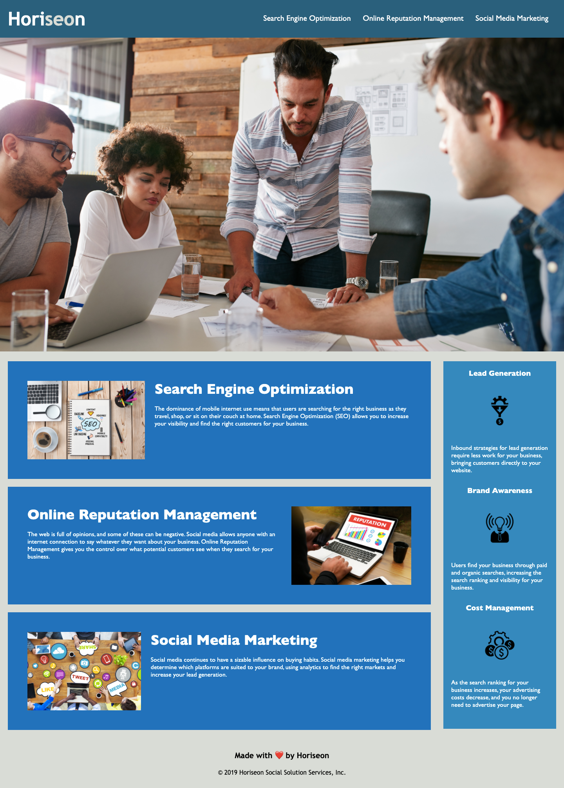

# Horiseon System Solutions

This assignment required me to review the HTML semantics and css styling for a webpage. There was no order to the HTML structure and the css styling was redundant. To meet basic accessibility standards, I have included an order to the HTML and a more coherent css styling sheet. 


```md

```


## Built With

Visual Studio Chrome


## Authors
Caitlin Tighe


## Acknowledgments

* Jonathan Gardner
* Andrew Finkernagel

